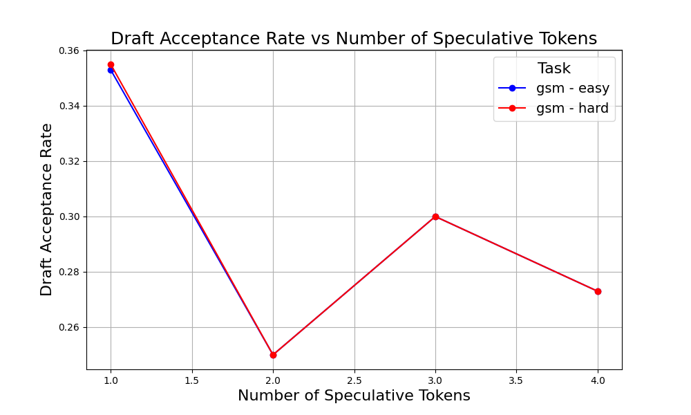
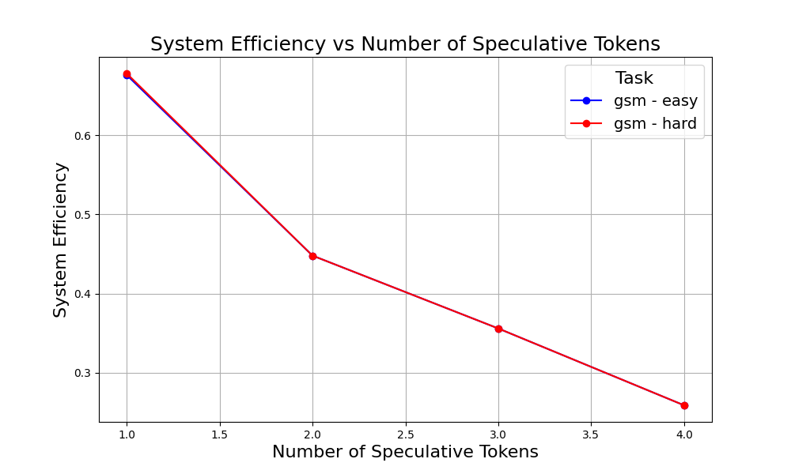
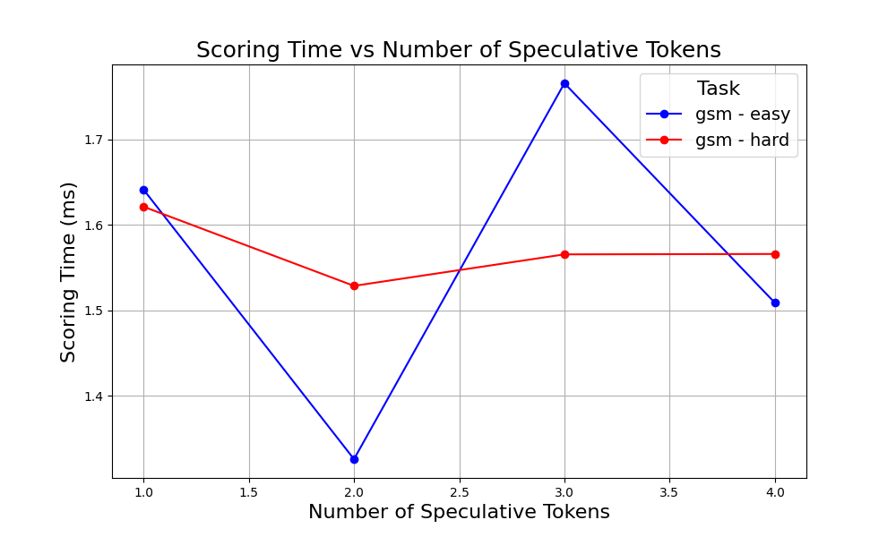
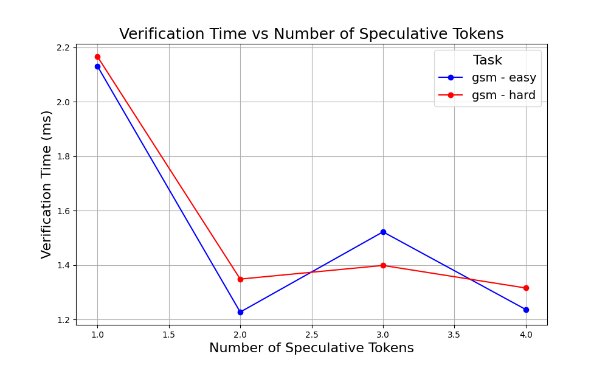
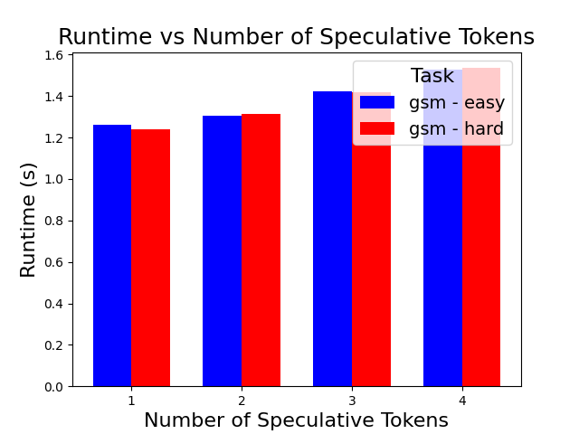

# Section 3: Efficiency

In this section, we present an example implemntation and usage of **Speculative Decoding** [[Leviathan et al 2023]()]. We provide a notebook with a minimal Speclative Decoding code, as well as share example scripts of using Speculative Decoding with [vLLM](https://docs.vllm.ai/en/latest/).

## File Structure
Code for this section is structured as follows:
- `Speculative_Decoding_Demo.ipynb` -- a Jupyter Notebook with a minimal implementation of Speculative Decoding. This version is **not** optimized and is intended only for educational purposes. It closely matches the code present in the tutorial slides.
- `speculative_decoding_vllm_benchmark.py` provides an example usage of Speculative Decoding with vLLM, a highly optimized library for efficient generation.
- `speculative_decoding_utils.py` contains helper logic for data manipulation / autoregressive generation.

## Speculative Decoding Benchmark
Using `speculative_decoding_vllm_benchmark.py`, we capture vLLM Speculative Decoding metrics such as: 
- Draft Acceptance Rate: The empirical acceptance rate of the proposal method on a per-token basis. This is useful for evaluating how well the proposal method aligns with the scoring method.
- System Efficiency: The empirical efficiency, measured as the number of tokens emitted by the system divided by the number of tokens that could be emitted by the system if the proposal method were perfect.
- Average Time per Proposal Token (ms): Time spent proposing the draft tokens divided by number of draft tokens.
- Scoring Time (ms): Total time spent scoring the draft tokens.
- Verification Time (ms): Total time spent verifying the draft tokens.

Example command line:
```bash
python speculative_decoding_vllm_benchmark.py
    --target_model_name meta-llama/Meta-Llama-3-8B-Instruct
    --helper_model_name ibm-fms/llama3-8b-accelerator 
    --instruct_mode 
    --dataset gsm 
    --num_samples 30 
    --seed 42 
    --max_new_tokens 100 
    --max_speculation_size 4
    --num_proc 6 
    --temperature 1.0
```


### Benchmark Results
Here are some example results we get from running the benchmark on an A100 80GB GPU:










